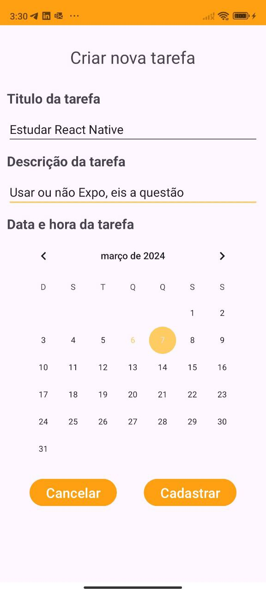
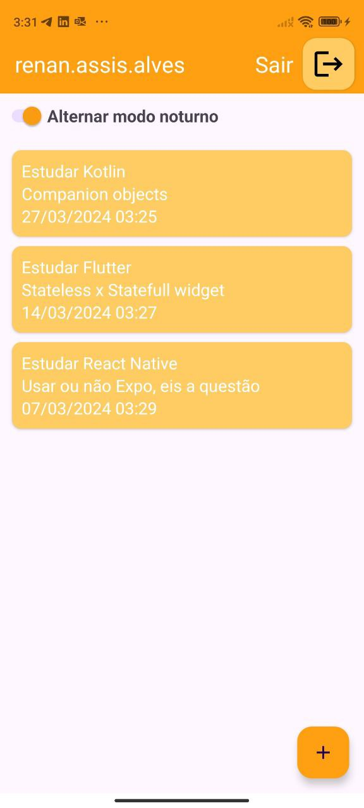
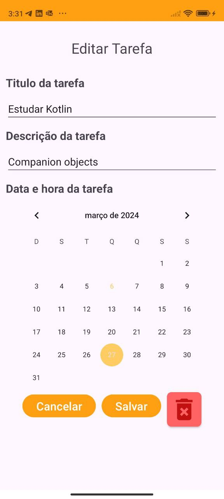

# Aplicativo Tarefas
Aplicativo para registro de tarefas a serem realizadas em uma determinada data.

## Tecnologias utilizadas

- Kotlin
- Login com o Firebase e Google Auth
- Persistência online com Firebase Realtime Database
- Persistência local com SharedPreferences
- Interface por design XML

## Prints da aplicação:

### Login

### Cadastrar uma nova tarefa

### Listar todas as tarefas

### Editar ou excluir uma tarefa

